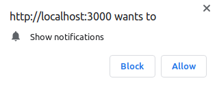

# Web Push Notifications in Ruby on Rails.

 | 
:-------------------------:|:-------------------------:
Push Notification 1           | Push Notification 2 

## Introduction

This repository demonstrates how to integrate Web Push Notifications into a web application, enabling real-time updates and alerts for users. Push notifications are a powerful tool for enhancing user engagement and keeping users informed about important events or updates within your application.

## Additional Resources

For more in-depth information and best practices on implementing Web Push Notifications in Ruby on Rails, check out our comprehensive article:

[Web Push Notifications in Ruby on Rails - Best Practices](https://medium.com/@dejanvu.developer/implementing-web-push-notifications-in-a-ruby-on-rails-application-dcd829e02df0)

## Prerequisites

Before implementing Web Push Notifications in your web application, make sure you have the following prerequisites in place:

- **Web Application**: You should have an existing web application where you want to incorporate push notifications.

- **Service Worker**: Create and configure a Service Worker in your application. A Service Worker is responsible for handling push notifications and background synchronization.

- **VAPID Keys**: Generate VAPID (Voluntary Application Server Identification) keys for secure communication with push service providers. You'll need these keys to establish a secure connection between your server and push service providers.

   To generate VAPID keys, you can use a tool or library like `web-push`. After generating the keys, store them securely in your environment variables or Rails credentials. Here's how you can set them up:

   - **Environment Variables**:

     ```
     DEFAULT_APPLICATION_SERVER_KEY=your_public_key_here
     DEFAULT_EMAIL=your@email.com
     DEFAULT_PRIVATE_KEY=your_private_key_here
     ```

   - **Rails Credentials**:

     Store your VAPID keys securely using Rails credentials:

     1. Open your Rails credentials file:

        ```bash
        rails credentials:edit
        ```

     2. Add the VAPID keys:

        ```yaml
        push_notifications:
          vapid_public_key: your_public_key_here
          vapid_email: your@email.com
          vapid_private_key: your_private_key_here
        ```

     3. Save and close the credentials file.

   Be sure to keep these keys confidential to maintain the security of your push notification system.


## Getting Started

Clone this repository to your local development environment:

1. Clone the repository:

```bash
git clone https://github.com/DeVuDeveloper/push-notifications.git
cd push-notifications
```

2. Install the required gems:

```bash
 bundle install
 bin/setup
```

3. Set up the database:

```bash
  rails db:create
  rails db:migrate
  rails db:seed
```


4. Run the server(Open your Browser and navigate to url: http://localhost:3000/): 

```bash
  bin/dev
```

## Linter

The Push Notifications App a linter. You can run the linter with the following command:

```bash
  rubocop && rubocop -A
```

## Testsing
To ensure that your push notification system works correctly across different browsers and devices, follow these testing steps:

1. Install any required testing dependencies if you haven't already.

2. Execute the tests to verify that push notifications are delivered and displayed as expected.

```bash
  rspec spec
  npm test
```

## Usage

1. **Sending Push Notifications**
   - Use the provided controller (`push-notifications-controller.rb`) to send push notifications to your users programmatically. You can trigger notifications for various events, updates, or relevant information within your application.
   - Customize the notification content, including the title, body, and icon, based on the context of your notifications.

2. **Handling Push Events**
   - The Service Worker (`service_worker.js`) will handle incoming push events and display notifications to users, even when they are offline. Ensure your Service Worker logic is correctly configured to provide a seamless notification experience.

## Built With 🔨

<div align="center">

|     | Languages                                                                                                                                                                                                                                                                                                                  |     |
| --- | -------------------------------------------------------------------------------------------------------------------------------------------------------------------------------------------------------------------------------------------------------------------------------------------------------------------------- | --- |
|     | ! |

<div align="center">


|     | Tools 🛠️                                                                                                                                                                                                                                                                                                                                                                                                                                                                              |     |
| --- | ------------------------------------------------------------------------------------------------------------------------------------------------------------------------------------------------------------------------------------------------------------------------------------------------------------------------------------------------------------------------------------------------------------------------------------------------------------------------------------- | --- |
|     |     |     |

<p align="right">(<a href="#top">back to top</a>)</p>
</div>

## Authors ✍️

<div align="center">

| 👤 DeVuDeveloper|
| -------- |

| <a target="_blank" href="https://github.com/DeVuDeveloper"></a> <a target="_blank" href="https://www.linkedin.com/in/devuj/"></a> <a target="_blank" href="https://twitter.com/DejanVuj"></a>
|

</div>

<p align="right">(<a href="#top">back to top</a>)</p>

## Conclusion

This project serves as a comprehensive guide for integrating Web Push Notifications into your web application. By following the provided instructions and customizing the code to your specific use case, you can enhance user engagement and keep your users well-informed.

For additional information and support, please refer to the documentation of the libraries and services used in this project.

Happy coding!

